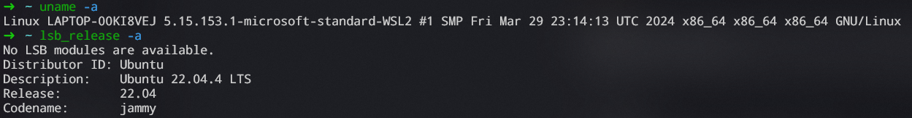
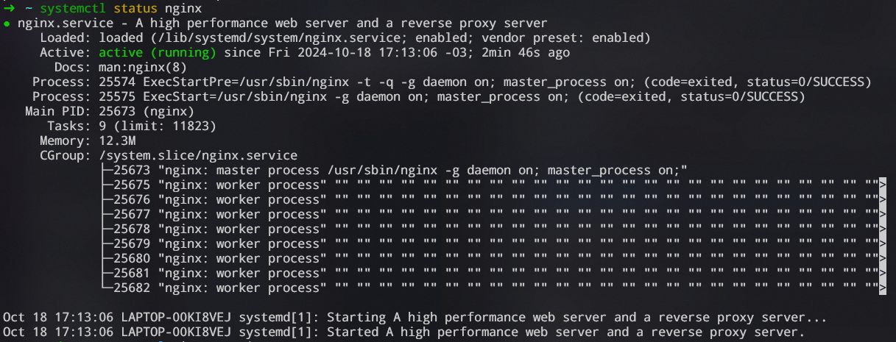
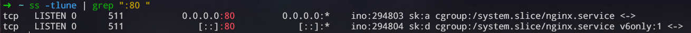
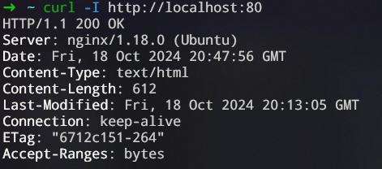

## Criar um ambiente Linux no Windows:

### Utilizando o WSL do Windows, crie um subsistema do Ubuntu 20.04 ou superior

Para instalar uma distuibuição Linux no Windows através do WSL 2, basta abrir o PowerShell, e digitar o seguinte commando:
```bash
wsl --install Ubuntu
```
Com o commando `wsl --install Ubuntu`, rapidamente é instalada a versão mais recente do Ubuntu LTS.

Detalhes do sistema:



## Atividade no Linux:
### Subir um servidor Nginx, deve estar online e rodando

Instalação do Nginx:
```bash
sudo apt install nginx
```

Checando status do serviço do Nginx:
```bash
systemctl status nginx
```


Checando se o Nginx está rodando, filtrando pela porta `80`:
```bash
ss -tulne
```


Vamos enviar uma requisição para o servidor
```bash
curl -I http://localhost:80
```


---

### Criar um script que valide se o serviço está online e envie o resultado da validação para um diretório que você definir

Criando o arquivo do script:
```bash
touch check_nginx.sh
```

Validando a disponibilidade do serviço:
```bash
if systemctl is-active --quiet nginx; then
  log="Nginx está rodando!"
fi
```

Armazenando o resultado:
```bash
if [[ -f "nginx_logs/result.txt" ]]; then
  echo "$log" >> result.txt
else
  mkdir "nginx_logs"
  echo "$log" > result.txt
fi
```

### O script deve conter - Data HORA + nome do serviço + Status + mensagem personalizada de ONLINE ou offline

Alterando a condicional para atender os novos requisitos:
```bash
if systemctl is-active --quiet nginx; then
  status="ONLINE"
  message="Nginx está rodando!"
else
  status="OFFLINE"
  message="Nginx não está ativo ou está com problemas!"
fi
```

Atualizando a saída do script:
```bash
timestamp=$(date "+%Y-%m-%d %H:%M:%S")
log="$timestamp Nginx $status - $message"

if [[ -d "nginx_logs" ]]; then
  if [[ -f "result.txt" ]]; then
    echo "$log" >> result.txt
  else
    echo "$log" > result.txt
  fi
else
  mkdir "nginx_logs"
  echo "$log" > "nginx_logs/$log_file"
fi  
```

### O script deve gerar 2 arquivos de saída: 1 para o serviço online e 1 para o serviço OFFLINE

Criando a diferenciação dos arquivos de saída:
```bash
timestamp=$(date "+%y-%m-%d %h:%m:%s")
log="$timestamp Nginx $status - $message"

if [[ $status == "ONLINE" ]]; then
  log_file="online_log.txt"
elif [[ $status == "OFFLINE" ]]; then
  log_file="offline_log.txt"
fi

if [[ -d "nginx_logs" ]]; then
  if [[ -f "nginx_logs/$log_file" ]]; then
    echo "$log" >> "nginx_logs/$log_file"
  else
    echo "$log" > "nginx_logs/$log_file"
  fi
else
  mkdir "nginx_logs"
  echo "$log" > "nginx_logs/$log_file"
fi
```

### Preparar a execução automatizada do script a cada 5 minutos
Abrindo o agendador de tarefas do Linux:
```bash
crontab -e
```

Adicinando o seguinte código para executar a tarefa como o desejado (o caminho é relativo ao local em que estou armazenando o script)
```bash
*/5 * * * * ~/code/linux-activ-compass/check_nginx.sh
```

### Fazer o versionamento da atividade

Iniciando um novo repositório:
```bash
git init
```
Adicionando os arquivos para serem commitados:
```bash
git add .
```
Fazendo o `commit`:
```bash
git commit -m "initial commit"
```
Renomeando a branch `master` para `main`:
```bash
git branch -M main
```
Adicionando o `.git` do repositório remoto:
```bash
git remote add origin https://github.com/Paulooo0/linux-activ-compass.git
```
Dando `push` das alterações na branch `main` recém criada:
```bash
git push -U origin main
```

### Fazer a documentação explicando o processo de instalação do Linux.
<a src="https://github.com/Paulooo0/linux-activ-compass/blob/main/README.md">README.md</a>