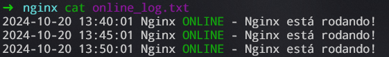
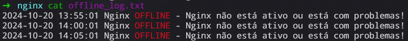

## Criar um ambiente Linux no Windows:

### Utilizando o WSL do Windows, crie um subsistema do Ubuntu 20.04 ou superior

Para instalar uma distuibuição Linux no Windows através do WSL 2, basta abrir o PowerShell, e digitar o seguinte commando:
```bash
wsl --install Ubuntu
```
Com o commando `wsl --install Ubuntu`, rapidamente é instalada a versão mais recente do Ubuntu LTS.

Para acessar o seu Linux, basta apertar o botão `Win` do Windows e digitar o nome da sua distribuição Linux, que neste caso, é `Ubuntu`.

Ao acessar pela primeira vez, você criará um usuário e senha. Após criado o usuário, digite os seguintes comandos para ver os detalhes do seu sistema:
```bash
uname -a
lsb_release -a
```

Detalhes do sistema:


**Após seguir estes passos, seu `Linux` via `WSL` está devidamente instalado.**

## Atividade no Linux:
### Subir um servidor Nginx, deve estar online e rodando

Instalação do Nginx:
```bash
sudo apt install nginx
```

Checando status do serviço do Nginx:
```bash
systemctl status nginx
```


Checando se o Nginx está rodando, filtrando pela porta `80`:
```bash
ss -tulne
```


Vamos enviar uma requisição para o servidor
```bash
curl -I http://localhost:80
```


---

### Criar um script que valide se o serviço está online e envie o resultado da validação para um diretório que você definir

Criando o arquivo do script:
```bash
touch check_nginx.sh
```

Validando a disponibilidade do serviço:
```bash
if systemctl is-active --quiet nginx; then
  log="Nginx está rodando!"
fi
```

Armazenando o resultado e tratando permissões:
```bash
log_dir="/var/log/nginx/"
log_file="result.txt"

if [[ ! -d "$log_dir" ]]; then
	echo "check_nginx: Diretório $log_dir não encontrado, nessário permissão para criar diretório"
	sudo mkdir -p "$log_dir"
	sudo chmod 775 "$log_dir"
fi

if [[ ! -w "$log_dir" ]]; then
	echo "check_nginx: Não é permitido escrita em $log_dir, necessário permissão para prosseguir"
	sudo chmod 775 "$log_dir"
fi
echo "$log" >> "$log_dir$log_file"
```

### O script deve conter - data e hora + nome do serviço + status + mensagem personalizada de online ou offline

Alterando as condições para atender os novos requisitos:
```bash
if systemctl is-active --quiet nginx; then
  status="ONLINE"
	colored_status="\e[32m$status\e[0m"
  message="Nginx está rodando!"
else
  status="OFFLINE"
	colored_status="\e[31m$status\e[0m"
  message="Nginx não está ativo ou está com problemas!"
fi
```

Atualizando o resultado final do script:
```bash
timestamp=$(date "+%Y-%m-%d %H:%M:%S")
log="$timestamp Nginx $colored_status - $message"
echo -e "$log" >> "$log_dir$log_file"
```

### O script deve gerar 2 arquivos de saída: 1 para o serviço online e 1 para o serviço offline

Criando a diferenciação dos arquivos de saída:
```bash
if systemctl is-active --quiet nginx; then
	status="ONLINE"
	colored_status="\e[32m$status\e[0m"
	message="Nginx está rodando!"
	log_file="online_log.txt"
else
	status="OFFLINE"
	colored_status="\e[31m$status\e[0m"
	message="Nginx não está ativo ou está com problemas!"
	log_file="offline_log.txt"
fi

log_dir="/var/log/nginx/"

if [[ ! -d "$log_dir" ]]; then
	echo "check_nginx: Diretório $log_dir não encontrado, criando diretório"
	sudo mkdir -p "$log_dir"
	sudo chmod 775 "$log_dir"
fi

if [[ ! -w "$log_dir" ]]; then
	echo "check_nginx: Não é permitido escrita em $log_dir, necessário permissão para prosseguir"
	sudo chmod 775 "$log_dir"
fi

timestamp=$(date "+%Y-%m-%d %H:%M:%S")
log="$timestamp Nginx $colored_status - $message"
echo -e "$log" >> "$log_dir$log_file"
```

### Preparar a execução automatizada do script a cada 5 minutos
Adicionando o script para um diretório que está no PATH, para que seja executado sem restrições de diretório:
```bash
sudo cp ./check_nginx.sh /usr/bin
```

Dando permissão de execução para o script:
```bash
sudo chmod +x check_nginx.sh
```

Abrindo o agendador de tarefas do Linux:
```bash
crontab -e
```

Adicinando o seguinte código para executar a tarefa desejada
```bash
*/5 * * * * check_nginx.sh
```

Resultado final:




### Fazer o versionamento da atividade

Iniciando um novo repositório:
```bash
git init
```
Adicionando os arquivos para serem commitados:
```bash
git add .
```
Fazendo o `commit`:
```bash
git commit -m "initial commit"
```
Renomeando a branch `master` para `main`:
```bash
git branch -M main
```
Adicionando o `.git` do repositório remoto:
```bash
git remote add origin https://github.com/Paulooo0/linux-activ-compass.git
```
Dando `push` das alterações na branch `main` recém criada:
```bash
git push -U origin main
```

### Fazer a documentação explicando o processo de instalação do Linux.
[Criar um ambiente Linux no Windows](#Criar-um-ambiente-Linux-no-Windows)
